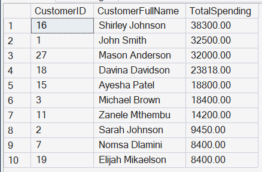
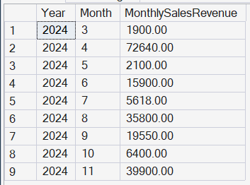

# 🛒 Retail Sales & Customer Analytics (SQL Server Project)

## 📌 Project Overview
A relational database system built in SQL Server to simulate a retail environment, supporting both transactional processing and analytical workloads.

The project focuses on database design, query optimization, and backend logic, using T-SQL to manage data integrity and generate performant business queries

---

## 🧠 Objective
Design and implement a scalable, normalized database system that:

Handles core retail transactions (orders, products, payments)
Ensures data integrity through constraints and relationships
Supports analytical queries without compromising performance
---

## 🏗️ Database Design

### ✔️ Core Entities:
- Customers
- Orders
- OrderItems
- Products
- Employees
- Payments

### ✔️ Design Approach
- Structured using Third Normal Form (3NF) to eliminate redundancy
- Enforced primary and foreign key constraints for referential integrity
- Separated transactional and analytical concerns using views
- ERD (Entity Relationship Diagram)

### 🔹 Relationships (Simplified)
- Customers (CustomerID PK)
- Orders (OrderID PK, CustomerID FK, EmployeeID FK)
- OrderItems (OrderItemID PK, OrderID FK, ProductID FK)
- Products (ProductID PK)
- Payments (PaymentID PK, OrderID FK)
- Employees (EmployeeID PK)
  
The schema ensures consistency across transactions while allowing efficient JOIN operations for reporting.

---

## ⚙️ Core Functionality

### 🔹 Transactional Logic (Stored Procedures)

Implemented stored procedures to simulate real-world operations and enforce consistency:

- `AddCustomer` – Inserts validated customer records 
- `AddEmployees` – Manages employee data for operational tracking
- `AddProducts` – Handles product catalog with pricing logic 
- `CreateOrdersWithItems` – Atomically creates orders and associated items 
- `RecordPayments` – Records payments and derives totals from order data 

Transactions are structured to maintain atomicity and consistency, reducing risk of partial writes.

---

### 🔹 Analytical Queries
Designed queries to support business reporting while maintaining efficiency:

- Revenue aggregation
- Customer ranking by spend
- Product performance analysis
- Category-level revenue breakdown
- Monthly sales trends
- High-value transaction detection

---

### 🔹 Advanced SQL Features
- Complex multi-table JOINs
- Subqueries & correlated subqueries
- Common Table Expressions (CTEs) for modular query design
- Window functions:
RANK()
DENSE_RANK()
ROW_NUMBER()
LAG()
- Aggregations using GROUP BY and HAVING

---

### 🔹 Data Quality Checks
- Identification of missing or inconsistent data
- Validation of relationships between tables
- Detection of unused or inactive records

---

### 🔹 Reporting Layer (Views)
Created reusable SQL views to abstract complexity:
- Customer spending summary
- Product sales performance
- Employee sales contribution
- Order-level summaries
- 
Views act as a lightweight reporting layer for BI tools or dashboards.

---

## 🧩 Entity Relationship Diagram (ERD)

---

## 📊 Sample Query Results

### 🔹 Top Customers by Spending

Shows the highest spending customers, helping identify high-value clients for targeted marketing.

### 🔹 Monthly Revenue Trend

Provides a month-by-month breakdown of total revenue, helping identify seasonal patterns, peak sales periods, and potential slow months that may require strategic intervention.

---

## 📊 Example Insights Generated

- Identify top-performing customers
- Track revenue growth over time
- Analyze product demand by category
- Monitor employee sales contribution
- Measure customer purchasing behavior

---

## 🛠️ Tools & Technologies
- Microsoft SQL Server 2022
- SQL Server Management Studio (SSMS)
- T-SQL

---

▶️ How to Run
Execute schema.sql to create tables
Run data_inserts.sql to populate sample data
Execute stored procedures and analytical queries from respective scripts

---

## 📁 Project Structure
/Schema
   Create_Tables.sql
/Data
   Insert_Sample_Data.sql
/Queries
   Basic_Queries.sql
   Analytical_Queries.sql
   Advanced_Queries(Window_Functions).sql
/Stored_Procedures
   Stored_Procedures.sql
/Views
   Reporting_Views.sql
/Data_Quality_Checks
   Data_Quality_Checks.sql
/ERD
   ERD.png
/Screenshots
   customer_spending.png
   monthly-revenue.png

README.md

---

## 🚀 Key Learning Outcomes
Through this project, I gained hands-on experience in:

- Designing scalable relational databases
- Writing efficient and complex SQL queries
- Implementing business logic using stored procedures
- Performing data analysis using SQL
- Applying window functions for advanced insights
- Structuring databases for real-world applications

---

## 🔗 Project Link
👉 https://github.com/liyabona-dev/sql-retail-sales-and-customer-analytics

---

## 👤 About Me
I am an aspiring SQL Developer with a strong interest in data and database systems. I enjoy solving business problems using SQL and continuously improving my skills in data analysis and database design.

---

## 📬 Let’s Connect
- LinkedIn: www.linkedin.com/in/liyabona-okuhle-mafusini-638489376
- GitHub: https://github.com/liyabona-dev
