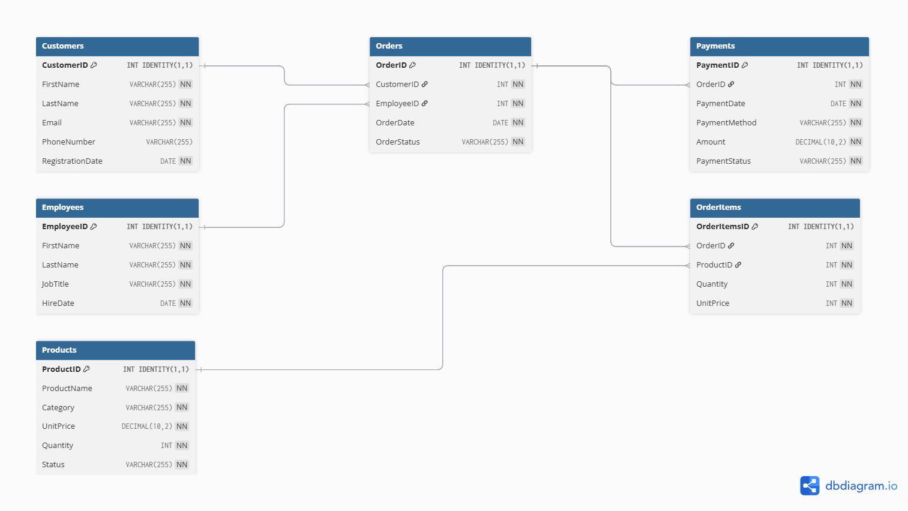

# 🛒 Retail Sales & Customer Analytics (SQL Server Project)

## 📌 Project Overview
This project simulates a real-world retail business environment, focusing on order management, customer behavior, and sales analytics.

The goal of this project is to design and implement a **relational database system** that supports both **transactional operations** (orders, payments) and **analytical reporting** for business decision-making.

It demonstrates how raw transactional data can be transformed into meaningful insights using SQL Server.

---

## 🧠 Business Problem
Retail businesses generate large volumes of data daily, including:
- Customer purchases
- Product sales
- Payment transactions

However, without proper structure and analysis, this data cannot effectively support:
- Revenue tracking
- Customer insights
- Product performance analysis

This project solves that by building a **structured database system** and delivering **analytical queries and reports**.

---

## 🏗️ Database Design

### ✔️ Key Entities:
- Customers
- Orders
- OrderItems
- Products
- Employees
- Payments

### ✔️ Features:
- Fully normalized relational schema
- Primary & foreign key constraints
- Data integrity enforcement
- ERD (Entity Relationship Diagram)

---

## ⚙️ Core Functionality

### 🔹 Transactional Logic (Stored Procedures)

This project includes stored procedures that simulate real business operations:

- `AddCustomer` – Inserts new customers into the system with controlled input handling  
- `AddEmployees` – Adds employee records to support order processing and tracking  
- `AddProducts` – Manages product catalog entries, including pricing and categorization  
- `CreateOrdersWithItems` – Handles order creation and item insertion in a single operation, ensuring data consistency  
- `RecordPayments` – Records payments and automatically calculates total order value from order items  

Example executions are included to demonstrate real usage.

---

### 🔹 Analytical Queries
The project includes real business-focused SQL queries such as:

- Total revenue generated
- Top customers by spending
- Best-selling products
- Revenue by category
- Monthly sales trends
- High-value orders

---

### 🔹 Advanced SQL Features
- Complex JOIN operations
- Subqueries & Correlated Subqueries
- Common Table Expressions (CTEs)
- Window Functions:
  - RANK()
  - DENSE_RANK()
  - ROW_NUMBER()
  - LAG()
- Aggregations and grouping

---

### 🔹 Data Quality Checks
- Identification of missing or inconsistent data
- Validation of relationships between tables
- Detection of unused or inactive records

---

### 🔹 Reporting Layer (Views)
Created SQL views to simplify reporting and support business insights:
- Order summaries
- Employee sales performance reports
- Customer spending reports
- Product sales performance reports

---

## 🧩 Entity Relationship Diagram (ERD)

---

## 📊 Sample Query Results

### 🔹 Top Customers by Spending

Shows the highest spending customers, helping identify high-value clients for targeted marketing.

### 🔹 Monthly Revenue Trend

Provides a month-by-month breakdown of total revenue, helping identify seasonal patterns, peak sales periods, and potential slow months that may require strategic intervention.

---

## 📊 Example Insights Generated

- Identify top-performing customers
- Track revenue growth over time
- Analyze product demand by category
- Monitor employee sales contribution
- Measure customer purchasing behavior

---

## 🛠️ Tools & Technologies
- Microsoft SQL Server 2022
- SQL Server Management Studio (SSMS)
- T-SQL

---

## 📁 Project Structure
/Schema
   Create_Tables.sql
/Data
   Insert_Sample_Data.sql
/Queries
   Basic_Queries.sql
   Analytical_Queries.sql
   Advanced_Queries(Window_Functions).sql
/Stored_Procedures
   Stored_Procedures.sql
/Views
   Reporting_Views.sql
/Data_Quality_Checks
   Data_Quality_Checks.sql
/ERD
   ERD.png
/Screenshots
   customer_spending.png
   monthly-revenue.png

README.md

---

## 🚀 Key Learning Outcomes
Through this project, I gained hands-on experience in:

- Designing scalable relational databases
- Writing efficient and complex SQL queries
- Implementing business logic using stored procedures
- Performing data analysis using SQL
- Applying window functions for advanced insights
- Structuring databases for real-world applications

---

## 🔗 Project Link
👉 https://github.com/liyabona-dev/sql-retail-sales-and-customer-analytics

---

## 👤 About Me
I am an aspiring SQL Developer with a strong interest in data and database systems. I enjoy solving business problems using SQL and continuously improving my skills in data analysis and database design.

---

## 📬 Let’s Connect
- LinkedIn: www.linkedin.com/in/liyabona-okuhle-mafusini-638489376
- GitHub: https://github.com/liyabona-dev
